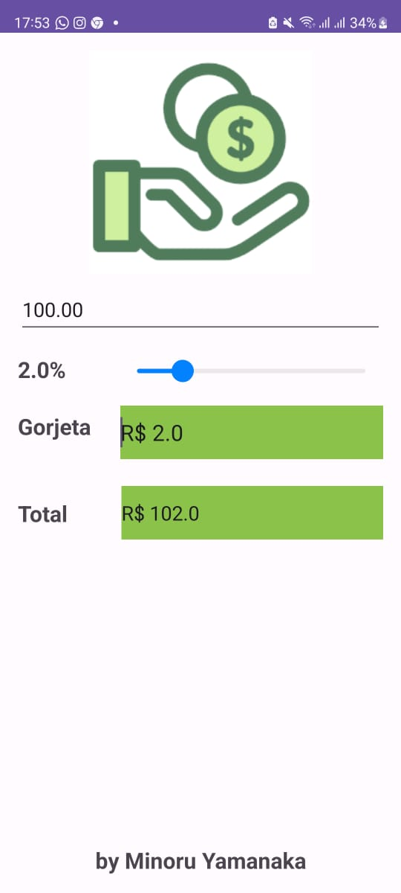

# Gorjeta 

Este é uma aplicação Android que calcula a gorjeta com base em um valor de conta e a porcentagem selecionada pelo usuário usando um `SeekBar`.

1. **Layout XML (`activity_main.xml`):**
   - Define a interface do usuário com elementos como `EditText` para o valor da conta, `TextView` para exibir a gorjeta e o total, e um `SeekBar` para selecionar a porcentagem da gorjeta.

2. **Classe Java (`MainActivity.java`):**
   - Declaração e inicialização de variáveis para os elementos da interface do usuário.
   - Usa o método `onCreate` para configurar a interface, atribuindo IDs aos elementos e configurando um `SeekBar.OnSeekBarChangeListener`.
   - O `OnSeekBarChangeListener` atualiza a porcentagem conforme o usuário move o `SeekBar` e chama o método `calcular`.
   - O método `calcular` é chamado para calcular a gorjeta com base no valor da conta e na porcentagem selecionada. O resultado é exibido nas `TextViews` apropriadas.

3. **Funcionamento:**
   - O usuário digita o valor da conta no `EditText`.
   - O `SeekBar` permite ao usuário escolher a porcentagem desejada.
   - Conforme o usuário interage com o `SeekBar`, a porcentagem é atualizada, e o método `calcular` é chamado para atualizar as `TextViews` com a gorjeta e o total calculados.
   - Se o valor da conta não for fornecido, uma mensagem de aviso é exibida usando `Toast`.

4. **Observações de Correção:**
   - Correções foram feitas para garantir que as `TextViews` `textTotal` e `textGorjeta` exibam os valores corretos após o cálculo.
   - A mensagem de aviso do `Toast` agora indica que o usuário deve digitar o valor da conta primeiro.

Em resumo, este código em java   implementa uma simples calculadora de gorjeta em uma aplicação Android, permitindo ao usuário personalizar a porcentagem da gorjeta com um `SeekBar`.

---

---

Prezado [Professor Douglas](linkedin.com/in/douglas-dos-reis-3473a868),

Agradeço imensamente pelas suas aulas de Desenvolvimento Mobile Android. A experiência ao criar este aplicativo foi incrível, e sua orientação foi essencial. Estou muito grato por todo o aprendizado proporcionado.

Atenciosamente, Minoru